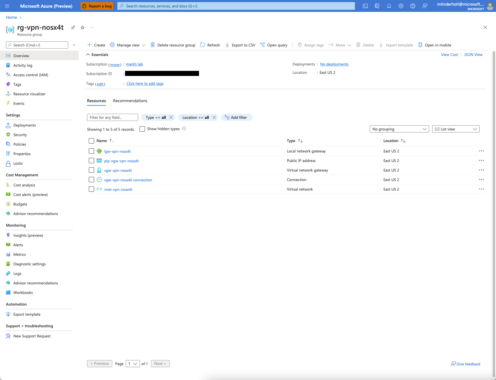
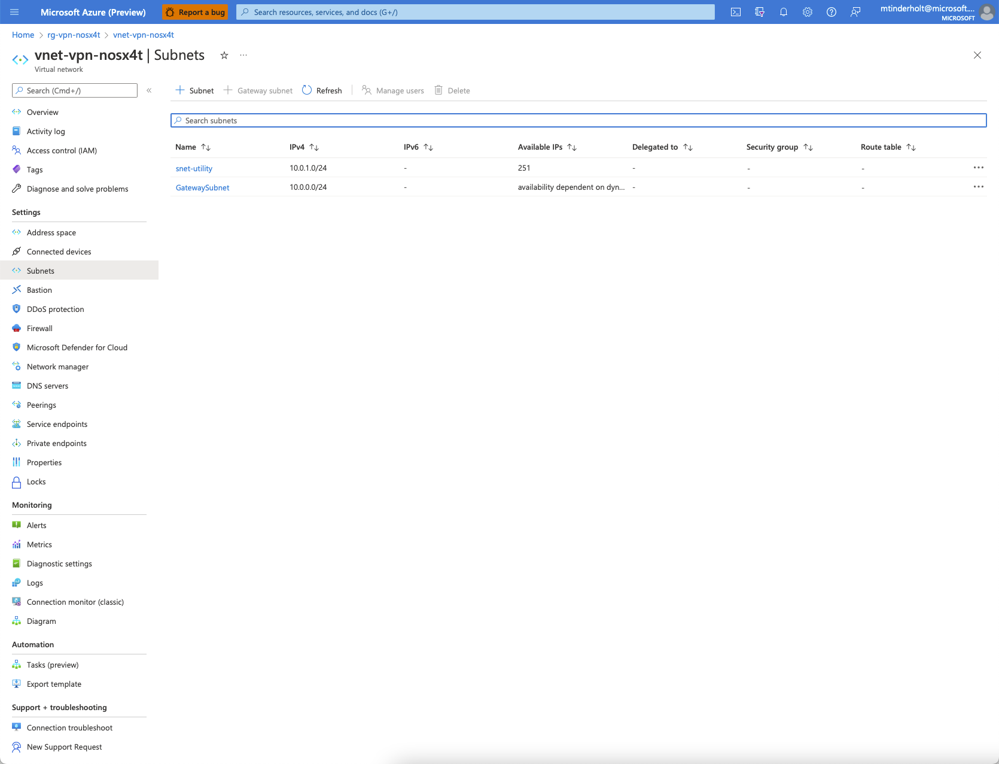
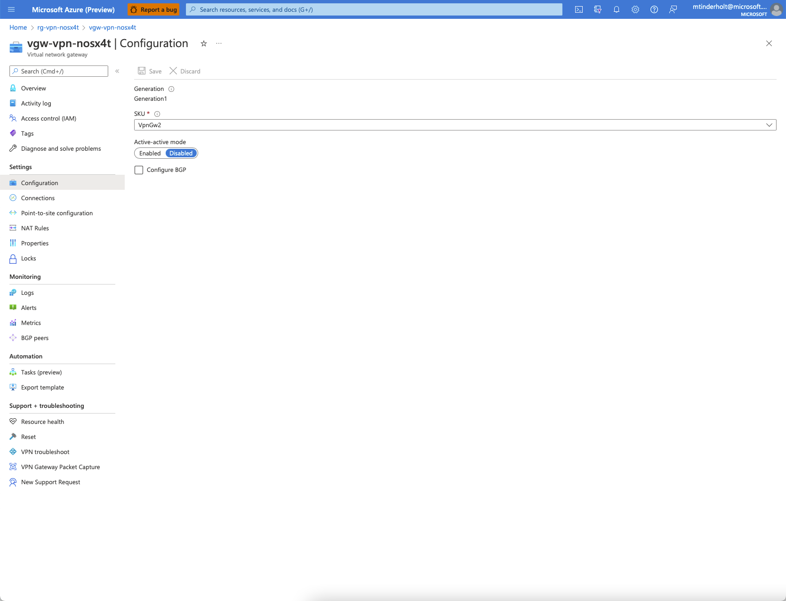
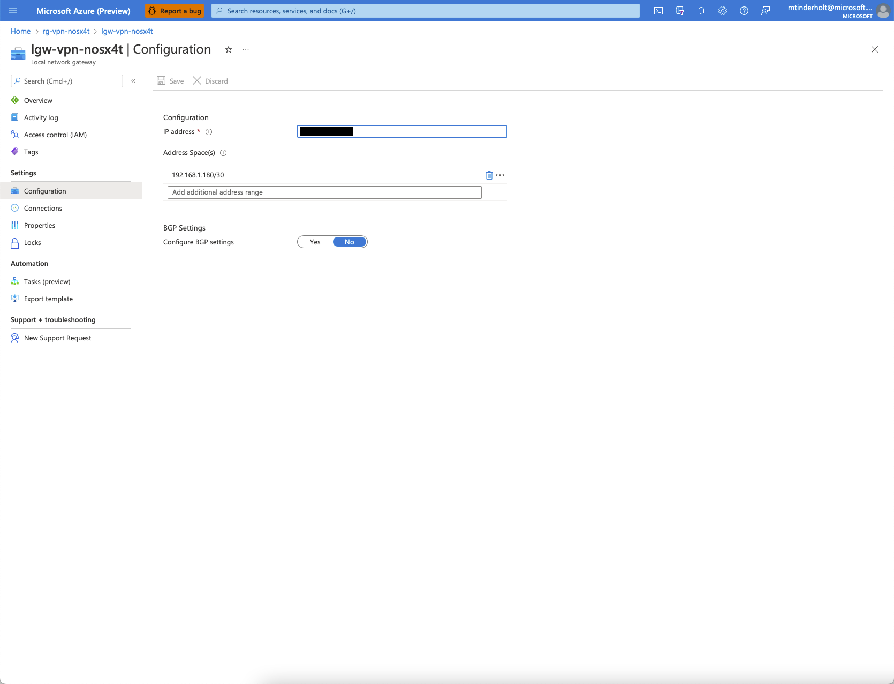
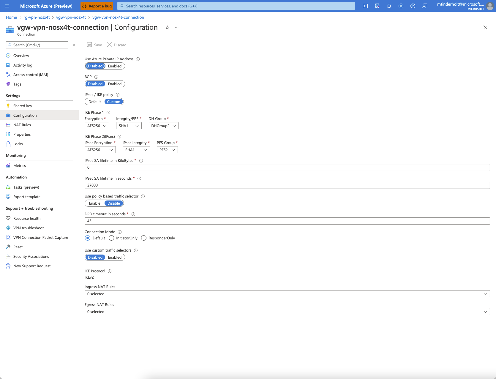
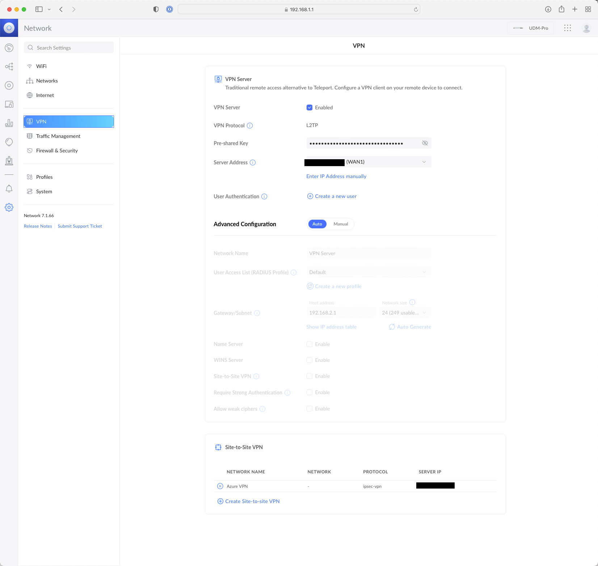
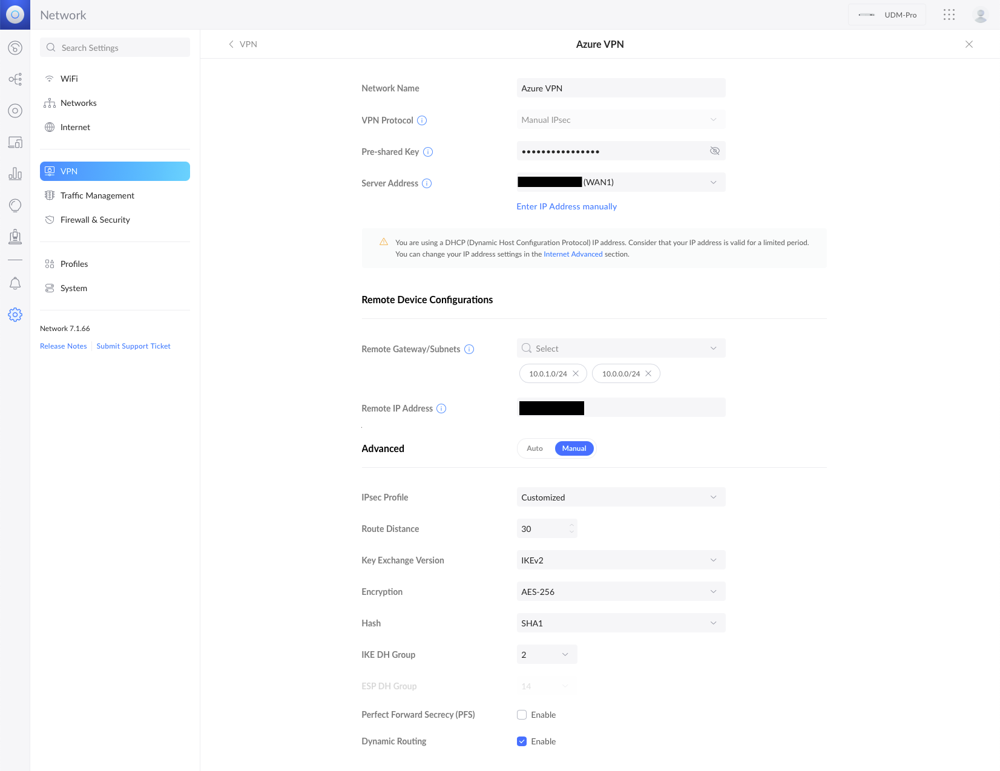

# Overview
This repository contains Terraform code that uses the `azurerm` provider to provision a Site-to-Site VPN connection with a Ubiquity Dream Machine Pro.

## Standard Azure Naming Conventions
https://docs.microsoft.com/en-us/azure/cloud-adoption-framework/ready/azure-best-practices/resource-abbreviations

## Configuring Terraform

|Variable Name|Description|
|--|--|
|local_ip_address|The public IP address of your home or business|
|local_address_space|The local network space of your on-premise network|
|preshared_key|The secret that is configured within your UniFi Dream Machine Pro|

## Azure Setup

Terraform will provision the following resources in Azure:

1. Virtual Network with two (2) subnets
2. Virtual Network Gateway and a Public IP Address
3. Local Network Gateway
4. VPN Connection

Notice that all the resources have the following string embedded within their names: 

>nosx4t

This is the random string generated by Terraform to ensure all resource names are unique.

### Virtual Network

Notice that we have two subnets, a special one called `GatewaySubnet` that is required by the Virtual Network Gateway and another one called `snet-utility` just for fun.

### Virtual Network Gateway

There is not a lot of configuration in the Virtual Network Gateway. In our setup we just need to attach the Public IP Address and want the following attributes to be set:

- VPN Type: Route-based
- SKU: VpnGw2
- Active-active: Disabled
- BGP: Disabled

### Local Network Gateway

You can't see it but my personal Public IP address is in the "IP Address" field. This can be found from the UniFi OS Console when you look at your WAN IP.

I've also included a small range of IP addresses within my local network `192.168.1.180/30`. The full range of IP addresses in my local network is `192.168.1.0/24` but the instructions that I found to set this up manually suggested using a narrower range. I'm not sure why.

### VPN Connection

This is where the magic really happens as these settings must line up with how you configure things on the local network side (within the UniFi OS Console)...more on that later.

## Local Setup

### UniFi VPN Setup

Under Network-->Settings-->VPN you need to enable the VPN server and enter the pre-shared key (which is also configured in the VPN Connection on the Azure side of things).

### Site-to-Site VPN

Then you need to add a Site-to-Site Network with the following configuration.

Again, I have blacked out the Remote IP Address but this is the IP Address of the Azure Public IP Address that is attached to your Virtual Network Gateway. 

We also need to add the network space of the Azure Virtual Network. I have included both subnet ranges but I'm guessing you could add the entire Vnet range if you so chose.

Finally we need to configure the following settings:

- Key Exchange Version: IKEv2
- Encryption: AES-256
- Hash: SHA-1
- IKE DH Geroup: 2
- Perfect Forward Secrecy (PFS): Disabled
- Dynamic Routing: Enabled

## References

 - https://www.starwindsoftware.com/blog/establish-a-site-to-site-vpn-between-azure-and-a-unifi-dream-machine-pro